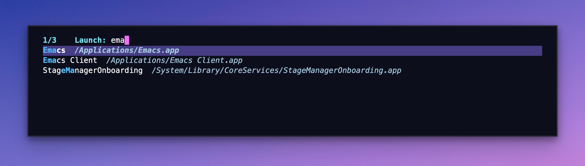

#+TITLE: launcher.el

Launch macOS applications from Emacs.

* Installation

#+begin_src emacs-lisp
(use-package launcher
  :vc (:url "https://github.com/xiaoxinghu/launcher.el" :rev :newest))
#+end_src

* Usage

- ~M-x launcher~ — pick and launch an app
- ~C-u M-x launcher~ — rebuild index first
- ~M-x launcher-refresh~ — rebuild index without launching
- ~M-x launcher-buffer~ — the same choices at the top of the selected
  window instead of the minibuffer (needs Vertico; see below)

If input matches no app, falls back to a web search (~launcher-fallback-search-url~).
Use ~!g query~, ~!gh query~, or ~!yt query~ for a specific search engine.
Empty input, whitespace, or a configured bang without a query cancels without
launching or searching.  Return accepts the completion UI's selected app even
when no text has been typed.

In stock completion, Space inserts a space and Tab completes.  Custom Space
bindings and completion UIs such as Vertico are preserved.

** App icons

On macOS, in a graphical frame, both commands show each app's own icon
before its name, as macOS draws it.  Nothing else changes: matching,
history, bangs, tools and what Return does are as before.  In a terminal,
or with ~(setq launcher-show-icons nil)~, the list is text only, as before.

- Icons come from AppKit (~NSWorkspace iconForFile:~), through macOS's
  built-in ~osascript~ and the packaged script ~assets/launcher-icons.js~:
  no compiler, Homebrew package, Python or icon font.  Install that file
  with the package (~package-vc~ does; a MELPA-style recipe needs
  ~:files ("*.el" "assets/launcher-icons.js")~).
- Missing icons are drawn in the background, all at once, and never slow
  typing: an app whose icon is not ready yet shows blank space as large,
  and its icon appears when the list is next redrawn.  Drawing 500 apps'
  icons takes a few seconds, once.
- ~launcher-icon-size~ (default 20) is the list's icon size in logical
  pixels; icons stay sharp up to 32 on a Retina display.  Rows of apps and
  of bangs are as tall as the icon or the line, whichever is taller.
- Icons are cached as 64-pixel PNGs in the ~v1~ subdirectory of
  ~launcher-icon-cache-directory~ (~cache/launcher/icons/~ in your Emacs
  directory), and survive restarts.
  A PNG is named after its app's path and its ~Info.plist~'s modification
  time, so an updated app gets a new icon.  ~C-u M-x launcher~ and
  ~M-x launcher-refresh~ delete the icons of apps that are gone.  An icon
  that changes without its ~Info.plist~, such as a custom Finder icon,
  goes unnoticed: ~M-x launcher-clear-icon-cache~ deletes all icons, which
  are then drawn again.  The launcher deletes only the PNGs it made.
- If an icon cannot be drawn, the app is listed and launched as usual; the
  failure is noted in the hidden buffer ~" *launcher-icons*"~ and tried
  again after the next index refresh.
- With icons, the launcher's completion category is ~launcher-app~, so
  that add-ons such as ~nerd-icons-completion~ add no generic icon of
  their own; Marginalia and Vertico work as before.

** Full-buffer launcher

~launcher-buffer~ offers exactly the choices of ~launcher~ (apps, bangs,
web fallback, empty-input cancellation, [[*Tools][tools]]), with Vertico showing the prompt
and candidates at the top of the selected ordinary window.  ~C-u~ also
rebuilds the index first.  It needs Emacs 29.1 and Vertico 2.x (tested with
2.15) with ~vertico-mode~ enabled.  Loading launcher does not load Vertico;
without a compatible Vertico, only ~launcher-buffer~ signals an error.

#+begin_src emacs-lisp
(use-package launcher
  :vc (:url "https://github.com/xiaoxinghu/launcher.el" :rev :newest)
  :bind ("C-c l" . launcher-buffer))
#+end_src

The command owns its interaction until a choice succeeds or you quit:

- It runs in the selected window: no split, other frame or resizing.  The
  picker shows up to ~vertico-count~ candidates, as bound when the command
  starts, or as many as a shorter window fits; moving the selection scrolls
  through the rest.
- Escape or ~C-g~ quits from any view, signaling ~quit~ as ~launcher~ does.
  Later views, a tool's query and its result, replace the picker in the
  same window; ~C-c C-b~ (~launcher-back~) returns to the previous view.
  These keys live in ~launcher-buffer-picker-map~, added to Vertico's keys
  in the picker and to ~launcher-query-map~ in a query, and
  ~launcher-buffer-map~, active in a result view only while its window is
  selected.  A result keeps its own mode and keys.  Both keymaps are in
  launcher-buffer.el, loaded on first use: change them in
  ~(with-eval-after-load 'launcher-buffer ...)~.
- On exit the window shows its previous buffer again, at the same position,
  with its dedication and buffer history.  If you put another buffer in the
  window meanwhile, it stays.  Deleting the window ends the interaction.
- Your completion styles, annotations, sorting, ~completing-read-function~
  (which must use Vertico) and Vertico keys apply.  The picker always uses
  Vertico's buffer display, in its own minibuffer only: other prompts,
  including ones nested inside the picker, keep your display modes and
  ~vertico-multiform~ rules.

It works in any ordinary window, with or without a host.  For example, with
Portal: ~(portal-launcher-present #'launcher-buffer :kind 'buffer :mode-line nil)~.
Sizing a host's window to its content is up to the host.

** Tools

~launcher-tools~ (default ~nil~) routes a prefix to a function of your own,
which looks something up and returns a buffer.  For example, with a
~my-dictionary-lookup~ you provide:

#+begin_src emacs-lisp
(setq launcher-tools
      '(("d" :name "Dictionary" :prompt "Word: "
              :function my-dictionary-lookup)))
#+end_src

Typing ~d~ and Space at the start of the input leaves the app list at once
for a query labelled ~Dictionary — Word:~.  The query is plain text: no
candidates, no completion and no web search; Space and Unicode are text.
Return calls the function once with the query, as typed after ~d SPC~, and
shows the buffer it returns.  Typing calls nothing.  Pasted text and history
recalled with ~M-p~ route the same way, the rest becoming the query.

- A prefix is any nonempty string without whitespace, such as ~d~, ~dd~ or
  ~!d~, matched exactly, case included, and only when followed by a Space.
  So ~d~ alone, ~D word~ or ~dx word~ is app or web input, as before.
  Prefixes must differ from each other and from the keys of
  ~launcher-bangs~; both commands check ~launcher-tools~ when they start,
  and refuse an invalid entry with an error saying what is wrong.
- The function takes one string and returns a live buffer.  It can be a
  named, autoloaded or anonymous function.  It does not prompt or display
  the buffer itself, and any normalization of the query is up to it.  It
  may keep updating its buffer after returning.
- A blank query is refused in place.  If the function signals an error,
  is not defined, or returns anything but a live buffer, the query reports
  it and keeps its text, so you can correct it and press Return again.
- In the query, ~C-c C-b~ (~launcher-back~), or deleting backward in an
  empty query, returns to the picker, which shows the prefix.  In
  ~launcher-buffer~, ~C-c C-b~ in a result returns to its query, with the
  text you submitted and without calling the function again.  Escape or
  ~C-g~ quits from any view.  Customize the query's keys in
  ~launcher-query-map~.
- ~launcher~ closes the minibuffer, then shows the result with
  ~pop-to-buffer~, following your display rules.  ~launcher-buffer~ shows
  it in its own window, where it keeps its major mode, keys and read-only
  state; scrolling and copying work as in any buffer.  A result that grows
  keeps your position, unless point is at the end of a nonempty result:
  then the window follows the new text.
- Launcher never kills, erases or changes a result buffer.  Quitting or
  going back does not stop the function's own work: a buffer it keeps
  updating does so in the background, and is not shown again.
- With tools configured, both commands open even when app discovery fails
  (say, without Spotlight's ~mdfind~): the prompt reads
  ~Launch (apps unavailable):~ and the reason is in ~*Messages*~.  Without
  tools, such failures are errors, as before.
- Each tool keeps its own query history, separate from the picker's, for
  the session only: routed input never enters the picker's history, and
  ~savehist-mode~ does not save tool queries.  To keep a tool's history like
  any other minibuffer history, name a variable with ~:history my-var~; ~:history
  t~ keeps none.
- A custom Space binding in the picker is kept; if it does not insert a
  space, type the prefix by pasting instead.

A host that shows only a minibuffer, such as Portal's ~:kind 'minibuffer~
panel, has no window to show a result in: ~launcher~ then shows it with
~pop-to-buffer~ in another frame or window, wherever your display rules
put it.  Use ~launcher-buffer~ in a buffer panel for results, or bind
~launcher-tools~ to ~nil~ around ~launcher~ there.

** Apple Dictionary

~launcher-osx-dictionary.el~ provides ~launcher-osx-dictionary-lookup~, a
tool function that looks a word up in Apple's dictionaries with the
[[https://github.com/xuchunyang/osx-dictionary.el][osx-dictionary]] package.  Launcher does not depend on that package, and
registers no prefix for it; choose your own:

#+begin_src emacs-lisp
(use-package osx-dictionary :ensure t)
(require 'launcher-osx-dictionary)
(setq launcher-tools
      '(("d" :name "Dictionary" :prompt "Word: "
              :function launcher-osx-dictionary-lookup)))
#+end_src

Then ~d SPC hello RET~ shows the definitions, rendered by osx-dictionary in
its own mode, in ~launcher-buffer~'s window, or by ordinary display from
~launcher~.  The lookup itself opens nothing: no Dictionary.app, browser,
second prompt, window or frame.

- Surrounding whitespace is trimmed; otherwise the word is looked up as
  typed, so phrases and non-ASCII words work.  osx-dictionary's choice of
  dictionaries (~osx-dictionary-select-dictionary~,
  ~osx-dictionary-allowed-dictionaries~) and search log apply.
- Results go to the buffer ~*Launcher Dictionary*~
  (~launcher-osx-dictionary-buffer-name~), reused by each lookup: the
  package's own ~*osx-dictionary*~ session is left alone.  A lookup that
  fails leaves the previous result as it was.
- The result keeps osx-dictionary's keys, except three that would show
  the package's own buffer or restore a window configuration it saved,
  replaced in this buffer only (~launcher-osx-dictionary-result-mode~):
  in ~launcher-buffer~, ~q~ and ~s~ return to the query, with the word,
  as ~C-c C-b~ does.  After ~launcher~, ~q~ quits the window as
  ~quit-window~ and ~s~ reads another word into this buffer.  ~S~ chooses
  the dictionaries, then looks the word up again in this buffer.  ~o~
  (open in Dictionary.app), ~r~ (read aloud) and ~?~ are the package's own.
- The lookup is synchronous: Emacs waits for it, typically well under a
  second, and quitting does not cancel it.
- It needs macOS, osx-dictionary, and its native helper
  ~osx-dictionary-cli~.  If the helper is missing, the first lookup builds
  it into the package's directory, as the package itself would, which
  needs Xcode's command line tools (~xcode-select --install~).  Typing never
  builds or looks anything up.
- Failures keep the query and its text, and say what went wrong: another
  platform, a missing package, an incompatible version, a missing helper
  source, compiler or writable directory, a failed build or helper, no
  installed dictionaries, a chosen dictionary that is not installed, or no
  definition.  The helper reports no errors of its own, and finds nothing
  both for an unknown word and for a failure while searching.  So only
  when it finds nothing, the adapter checks the helper and the
  dictionaries, by listing them.
- Tested with osx-dictionary commit ~655bca5~ (2026-09-06).  The package has
  no public way to look a word up without prompting and displaying, so
  the adapter uses its private ~osx-dictionary--insert-search-result~,
  ~osx-dictionary--current-dictionary-description~,
  ~osx-dictionary--current-word~ and ~osx-dictionary--load-dir~, and
  reports a version that lacks them.

* Development

Run the regression tests without Vertico, launching apps or opening a browser:

#+begin_src sh
sh test/elpa.sh   # pinned packages, into .cache/elpa
emacs --batch -Q -L . -L test -l test/launcher-tests.el -l test/launcher-buffer-tests.el \
  -l test/launcher-tools-tests.el -l test/launcher-osx-dictionary-tests.el \
  -l test/launcher-icons-tests.el -l test/launcher-icons-worker-tests.el \
  -f ert-run-tests-batch-and-exit
#+end_src

The icon cache checks (~test/launcher-icons-tests.el~) replace the worker
with a fake process, so they need neither macOS nor a display.
~test/launcher-icons-worker-tests.el~ runs the real worker on system apps
and on fake bundles in temporary directories, on macOS only, and skips
elsewhere.

The dictionary checks use the pinned osx-dictionary that ~test/elpa.sh~
fetches, and skip without it.  A fake helper script stands in for its
native one, so they need neither macOS nor dictionaries, and prove no real
lookup.

Vertico's display needs a graphical Emacs.  ~bash test/vm.sh~ runs the
graphical checks (~test/gui.sh~, which loads ~test/launcher-tools-gui-tests.el~,
~test/launcher-buffer-gui-tests.el~ and ~test/launcher-icons-gui-tests.el~) in a disposable Emacs in the macOS test VM
that Portal's ~test/vm.sh~ uses, without Portal, typing through AppKit's
event queue.  It fetches pinned Vertico, Orderless and Marginalia releases
with ~test/elpa.sh~ into ~.cache/elpa~, and copies logs and screenshots back
to ~.cache/vm/~.  Never run these checks in your own Emacs session.

Real lookups in Apple's dictionaries are opt-in, also in the VM:
~bash test/vm.sh sh test/gui.sh '^launcher-dictionary-real-'~ builds the
pinned osx-dictionary's helper in a temporary copy, looks words up through
both commands, and logs the environment and definitions.

* Works with [[https://github.com/xiaoxinghu/m-x][M-x.app]]

M-x.app registers the ~emacs://~ URL scheme, letting you invoke Elisp from a global hotkey anywhere on macOS. Bind it to =cmd + space=, you get a system-wide app launcher — Raycast-style, but in Emacs.

* Roadmap

This is part of a broader effort to replace Raycast with Emacs.

** TODO *Bang commands*
~!g query~, ~!gh repo~, ~!yt video~ to redirect input to configurable URL templates
** TODO *Custom commands*
register named elisp actions alongside apps via ~launcher-register-command~
** TODO *Built-in extensions*
calculator, clipboard history, window management, system commands (sleep/lock/restart), file search, quick links, snippets
